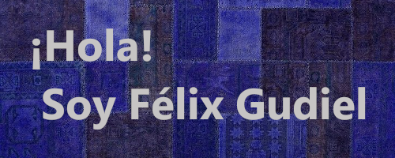

  

<h2 align="center">👨🏻‍💻 &nbsp;Sobre Mí</h2>

💡 &nbsp;Soy un desarrollador de software con experiencia práctica en el desarrollo de aplicaciones web y sistemas, utilizando tecnologías modernas como Hibernate, Spring Boot y modelos MVC.\
🔧 &nbsp;Tengo capacidad demostrada para integrar y coordinar diferentes componentes tecnológicos, resolver problemas complejos y gestionar proyectos de manera efectiva.\
🤝 &nbsp;He desarrollado fuertes habilidades de colaboración a través de trabajos en equipo.\
🌱 &nbsp;Estoy dispuesto a aprender nuevas tecnologías y adaptarme a nuevos desafíos.\
✉️ &nbsp;Puedes enviarme un correo a [felixangelgudiel@gmail.com](mailto:felixangelgudiel@gmail.com). ¡Intentaré responder lo antes posible!

<h2 align="center">🛠 &nbsp;Tech Stack</h2>

  &nbsp;
  &nbsp;
  &nbsp;
  &nbsp;
  &nbsp;
  &nbsp;
  &nbsp;
  &nbsp;
  &nbsp;
  &nbsp;
  &nbsp;
  &nbsp;
  &nbsp;
  &nbsp;
  &nbsp;
  

<h2 align="center">⚙️ &nbsp;GitHub Analytics</h2>

